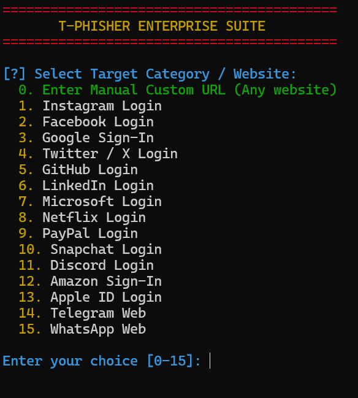
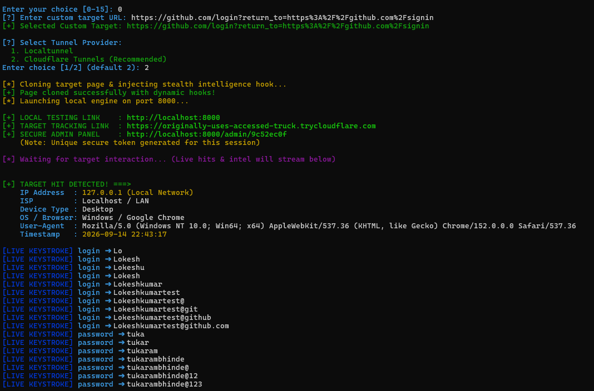

# 🚀 T-Phisher Enterprise Suite

**T-Phisher** is an advanced, CLI-driven phishing and intelligence framework designed for authorized penetration testing and security awareness training. It features automated website cloning, anti-bot protection, deep device fingerprinting, real-time credential sniffing, and a secure dynamic token-protected admin dashboard.

---

## 🌟 Key Features

* **📱 Interactive Target Menu:** Quick selection menu featuring top global platforms (Instagram, Facebook, Google, Twitter, GitHub, Netflix, etc.) plus a custom URL option.
* **🛡️ Anti-Bot & Crawler Protection:** Automatically detects and blocks security scrapers, bots, and crawlers (Googlebot, curl, python-requests, etc.) to protect infrastructure.
* **📍 Deep Device & IP Fingerprinting:** Captures real-time Visitor IP, ISP, Country, Operating System, Browser type, and Device category.
* **🔑 Real-Time Credential & Keystroke Sniffer:** Instantly streams captured form inputs and keystrokes line-by-line directly to your terminal.
* **🗄️ Session-Wise Local Storage:** Automatically isolates data per session, saving history and logs securely in local SQLite databases (`sessions/`).
* **🔐 Secure Dynamic Admin Panel:** Generates a unique, randomized security token for the admin dashboard (`/admin/{token}`) on every startup.
* **🌐 Dual Tunneling Support:** Seamlessly integrates with **Cloudflare Tunnels** (Recommended) and **Localtunnel** for fast public exposure.

---

## 🛠️ Tech Stack

* **Backend:** Python 3.10+, FastAPI, Uvicorn (Asynchronous & High-Performance)
* **HTML Parsing & Cloning:** BeautifulSoup4, HTTPX
* **Database & ORM:** SQLite, SQLAlchemy
* **Terminal Styling:** Colorama

---

## 📦 Installation & Setup

1. **Clone the repository:**
   ```bash
   git clone https://github.com/trmxvibs/TPhisher.git
   cd TPhisher
   ```
2. **Install dependencies:**

```Bash
pip install fastapi uvicorn sqlalchemy beautifulsoup4 httpx colorama
```
3. **Ensure Tunnel tools are available:**

For Cloudflare (Recommended): 
- Ensure cloudflared is installed in your system path.

For Localtunnel: 
- Ensure Node.js (npx) is installed

## 💻 Usage
Run the main control script from the root directory:
```
python tphisher.py
```
- Select a target platform from the interactive menu or enter a custom URL (0).

- Choose your preferred tunnel provider (1 for Localtunnel, 2 for Cloudflare).

- Copy the generated Target Tracking Link and share it with the target for simulation.

- Monitor live hits, deep device intel, and captured credentials in your terminal or via the secure Admin Panel link provided at startup.

---

## 📸 Working Demos & Preview

### 1. Proof of Concept (PoC) Working Video:
<video width="100%" controls>
  <source src="assets/working_poc.mp4" type="video/mp4">
  Your browser does not support the video tag.
</video>

### 2. Homepage / Target Selection:


### 3. Localhost Demo & Capture Interface:


---

## ⚠️ Disclaimer
This tool is created strictly for educational purposes, security research, and authorized penetration testing. The developer assumes no liability and is not responsible for any misuse or damage caused by this program.
